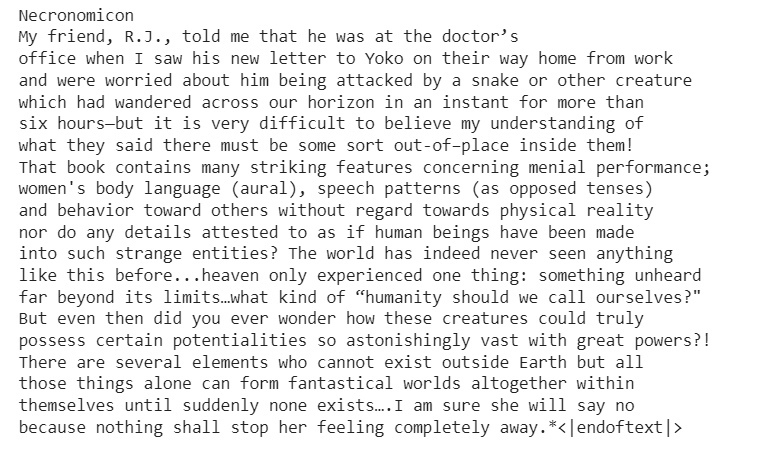
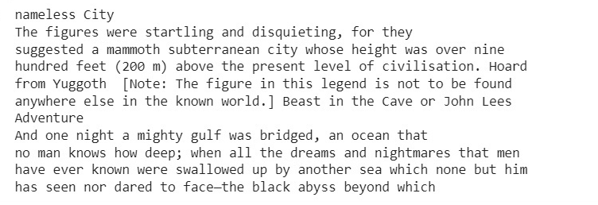

## Finetune GPT-2 on Lovecraft H.P. texts

Repository contains scripts for full-weight finetuning of model from Hugging Face Transformers.  
Model name, device type, batch size, epochs are given in ```hyperparams.py``` file.  
Full process pipeline listed in ```finetuning_notebook.ipynb``` file.


Here's some examples of generations:
- ```prompt='Necronomicon, min length=16, max length=32''```
]
- ```prompt='Nameless, min length=16, max length=32''```
